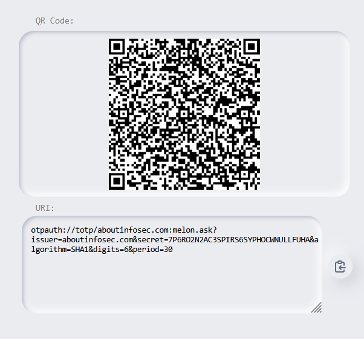
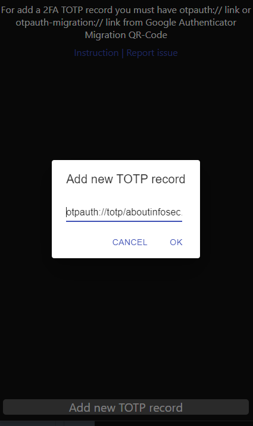
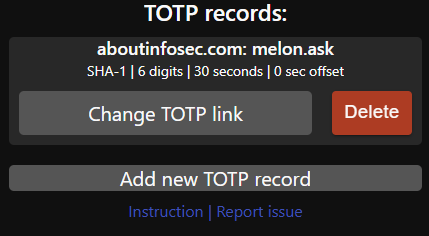
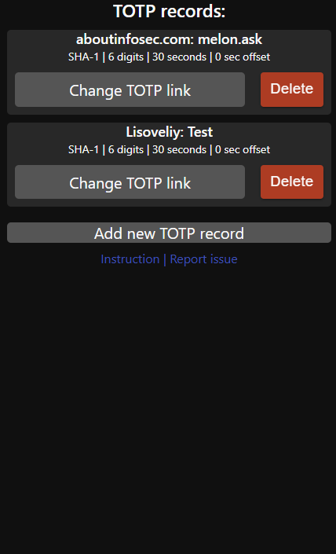

# How to add 2FA TOTP records (keys) on app

### If you use default 2FA otpauth:// links

To add 2FA TOTP records using 2FA TOTP QR-Codes, you must scan QR-Code of service providing 2FA and scan (decode) it to a URI. If you have screenshot of QR-Code -- scan it on any app providing scan from image, ex: Search screen on Google Assistant. For example, this QR-Code will represent next URI string:

Copy this URI string and paste it to app using button *"Add new TOTP record"*:

Then press OK, record will appear on page

You can edit your otpauth:// records using button "Change TOTP link". Your previous record will be replaced with a new otpauth:// link entered on text field, and previous link will not be shown on field.

### If you use google migrations (otpauth-migration:// links)

To add 2FA TOTP recods using migration from Google Authenticator app, you must go to menu, select "Transfer accounts" -> "Export accounts" 

Select codes then screenshot QR code and and scan (decode) it to a URI. Use any app providing scan from image, ex: "Search screen" function (Google Lens) on Google Assistant.

For example, this QR-Code will represent next URI string:

After scaning copy this URI string and paste it to app using button *"Add new TOTP record"*:

Then press OK, all selected records on Google Authenticator will appear on page

You can edit your records using button "Change TOTP link". Your previous record will be replaced with a new otpauth:// link entered on text field (otpauth-migration:// will not work), and previous link will not be shown on field.